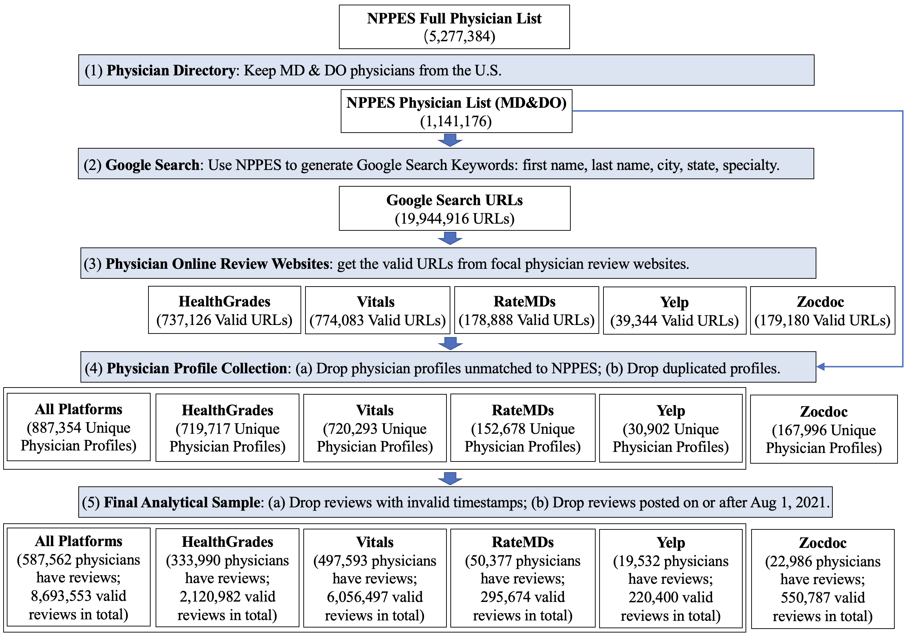

# Introduction
**Background** Online reviews are critical for improving transparency and trust in healthcare. They have become a major information source for physician reputation and are increasingly used by patients and healthcare organizations. However, once a review is posted, it tends to persist on the Internet. A physician’s reputation might be determined by reviews posted many years ago, which can be misleading.

**Methods** We used Google to search for online reviews for all 1,141,176 physicians in the United States. Four major platforms were identified: RateMDs, Yelp, Vitals, and Healthgrades. We collected all the online reviews for all available physicians. We analyzed the average age of reviews and investigated the difference between recent review scores and the overall ratings displayed on physician profiles. 

**Results**
The average age of online reviews is 5.30 years. Moreover, 39.82% of physicians’ profile ratings are solely based on reviews that are more than three years old. Ratings from the most recent three years are substantially inconsistent with 1) the profile ratings for 61.39% of all physicians and 2) the ratings from more than three years ago for 65.73% of all physicians.

**Conclusion**
The persistent nature of online reviews has created a situation where online review information is aging; an issue that will only be exacerbated with the passage of time. Physicians’ online reputation may be inappropriately determined by reviews posted years ago and may not be reflective of their more recent performance. Policy action is necessary to help prevent patients from being misled and physicians from being misrepresented by outdated online reviews. 


# Structure of Reprository

This repository contains two main parts: (1) Data Collection and (2) Data Analysis.

# Data Collection

## Data Collection Procedure



The above figure shows the data collection procedure.

## Physician Directory
We used the Centers for Medicare & Medicaid Services National Plan and Provider Enumeration System (NPPES) to identify all physicians in the United States. Only individual National Provider Identifiers (Entity Type Code=1) whose business practice addresses are located inside the United States were included. We focus on all healthcare professionals in the NPPES system with a credential of either MD (Doctor of Medicine) or DO (Doctor of Osteopathic Medicine), which resulted in 1,141,176 physicians. See the Folder [doctor_directory](doctor_directory) for the code and data source.


## Google Search

Google Search: To best capture the online reviews that a patient can retrieve, we followed what we expect is a typical strategy for patients looking for physicians. We searched for each physician on Google Search1 using a query that combined each physician’s full name, city and state of practice, and specialty.  See the Folder [doctor_directory](doctor_directory) for the code and data source. We generated NPI to Search Keywords in this folder.


For each query, the search results (URLs) that showed up in the first two pages (usually 20 URLs) were then saved. In total, 19,944,916 URLs were extracted from all the search results, which covered 1,058,331 (92.74%) physicians and pointed to various websites. 

See the Folder [google_search](google_search) for more information. The URL2SearchKeyword is in the folder [google_search/Data](google_search/Data). The summary of collected URL files is reported in file [URLReport.csv](google_search/Output/URLReport.csv)


## Physician Online Review Websites
Based on all websites returned in the search results, we identified the top online physician review platforms: Healthgrades (737,126), Vitals (774,083), RateMDs (178,888), ZocDoc (179,180), and Yelp (39,344). We then focused on these five platforms for our examination of online review information. See the summary of collected URL files [URLReport.csv](google_search/Output/URLReport.csv) for more information.

## Physician Profile Collection
We developed Python scripts to download the online reviews. Our Python scripts went through all URLs identified for the five online review platforms. The collection is time-consuming, the related code and data information is in Folder [doctor_reviews](doctor_reviews).


### Physician Cleansing
After collecting all the data, we first filter out the valid physicians. 
There were sometimes multiple, slightly different URLs pointing to different pages/sections of the same physician’s profile page. 

To construct the clean sample, we removed duplicated profile pages from the search results. The information collected includes each physician’s basic profile data, which we used to verify that the profile corresponds to the correct physician and online reviews. We also identified the duplicated and unmatched physicians from the dataset. 

After dropping mismatched and duplicated profiles and physicians with invalid profile scores, the number of physicians identified on each platform is: 719,717 (2,148,323 reviews) for Healthgrades, 720,293 (6,063,074 reviews) for Vitals, 152,678 (296,904 reviews) for RateMDs, 167,996 (901,681 reviews) for ZocDoc, and 30,902 (221,984 reviews) for Yelp. 

This detailed information for physician cleansing is in the file [PhysicianReport](final_analysis/PhysicianReport.csv).

### Why do we exclude ZocDoc?
Of the five platforms, 56.80% of ZocDoc reviews are not clearly labeled with exact posting time. Therefore, we focused on the other four platforms and excluded ZocDoc from our main analyses. As a robustness test, we also included the 43.20% of the ZocDoc reviews that provided timestamp and found consistent results.


## Final Analytical Sample
The reviews we studied here contain both review with and without textual comments.
We first filter out the reviews without valid timestamps. Then to align the observation date for all the physicians, we set our observation date as August 1st, 2021 and removed all online reviews posted after the observation date. After the above processing, the final data sample contains 8,693,553 reviews from the four major online review platforms: Healthgrades (2,120,982), Vitals (6,056,497), RateMDs (295,674), and Yelp (220,400). In total, among the 1,141,176 US physicians, our comprehensive data covers 887,354 physicians (77.76% of US physicians) who have at least one profile page from any of the five platforms and 587,562 (51.49% of US physicians) who have at least one review. For more information, see [ReviewReport](final_analysis/Output/MinText0/ReviewReport.csv).

# Data Analysis

Our final data sample contains 8,693,563 reviews from the four major online review platforms: Healthgrades (2,120,982), Vitals (6,056,497), RateMDs (295,674), and Yelp (220,400). In total, of the 1,141,176 physicians, 587,562 (51.49%) have at least one review on any of the above websites.

## Timeliness of Online Reviews
Across the four platforms, the average age of online reviews is 5.30 years as of August 1, 2021. This indicates that the average physician ratings published on the websites visited by patients as they search for doctors are based on online reviews that are 5.30 years old. Outdated information is prevalent on all the online physician review platforms ‒ the average age of online reviews is 2.74 years for Healthgrades, 6.08 years for Vitals, 7.80 years for RateMDs, and 5.10 years for Yelp. Across all platforms, millions of online reviews have accumulated in the past 17 years, but only a small proportion were written in recent years. Between August 1, 2020 and August 1, 2021 (the most recent year in our data), 542,998 reviews were created, constituting only 6.25% of all online reviews. If we extend this time window to two or three years, the number of reviews is 1,217,937 (14.01%) and 2,027,319 (23.32%), respectively. 

See [ResultForReviewAge](final_analysis/Data/ReviewAge) for detailed information.

The reviews created overall time is as:


## Physician Recent Review Rate

We calculated the average age of reviews for each of the `587,562` physicians who are rated on the four websites studied. The average physician-level review age is `4.92` years, which is very outdated. Significant review age is consistent across each platform: `3.02` years for Healthgrades, `6.05` years for Vitals, `8.32` years for RateMDs, and `4.78` years for Yelp. As reported in Figure 1, `233,988` `(39.82%)` of physicians have no recent reviews within a three-year period prior to our observation day (08/01/2018-2-08/01/2021). When we focus on the most recent two years or one year, the percentage of physicians without recent reviews is more alarming (`54.73%` for two years and `72.88%` for one year). See [ResultForPhysicianRecentRate](final_analysis/PhysicianRecentReview) for more information.

## Recent Review Scores Changed and Absent On Physician's Profile

Our results also show that the average rating for a physician, which is based on both recent and older ratings, are poorly correlated with the most recent ratings. For each physician, we compared the average rating from reviews created in the most recent year (as of Aug 1, 2021) to the average for all earlier years. To ensure the validity of this analysis, only physicians who have reviews in both periods were included, which resulted in a subsample pf 310,894 physicians. Overall, the average five-star rating for all physicians from February 4, 2004 (the first date of online reviews in our sample) to August 1, 2018 was 3.99 (SD = 0.90). Meanwhile, the average rating for the most recent three years (from August 1, 2018 to August 1, 2021) was 3.87 (SD 1.40). 

We also find substantial changes in ratings across years at the individual physician level. Panel A of Figure 2 reports the magnitude of the inconsistency between past and recent reviews. Of the physicians in this analysis (310,894), only 106,139 (34.14%) have stable ratings over time (less than 0.5 star difference in average ratings between the two time periods). For 97,538 physicians (31.37%), ratings decrease over time, with an average historical rating of 4.08 (SD = 0.73) and average recent rating of 2.21 (SD = 1.06). Finally, 107,217 physicians (34.49%) show a substantial increase from an average historical rating of 3.53 (SD=0.91) to an average recent rating of 4.81 (SD=0.48). These findings suggest that it can be misleading to use the average rating to infer a physician’s current quality.

We further compared the displayed overall profile rating for doctors on these websites with the most recent three years of ratings (from August 1, 2018 to August 1, 2021). As presented in Panel B of Figure 2, we find substantial inconsistency between these two values. Overall, 61.39% of all physicians’ recent ratings are substantially different from the online platform’s displayed profile rating (greater than 0.5 points), thus confirming that the timeliness of online physician reviews is a serious issue. 

These findings are robust to different cutoffs of recent online reviews across different physician online platforms, including one year (from August 1, 2020 to August 1, 2021) and three years (from August 1, 2018 to August 1, 2021). They are also robust to different thresholds of minimum review count. 

To see more information, check [RecentVSPast](final_analysis/Output/RecentVSPast) and [RecentVSProfile](final_analysis/Output/RecentVSProfile). 

# Data Quality Verification
We conducted several quality checks to ensure that our data collection is accurate and complete.

## Cross-check NPI Information

The NPI verification was conducted in Step (4) of Figure S1. We used information from the NPPES, linked to a unique NPI for each physician, to generate the search keywords and then used Google Search to find URLs for physician profile webpages. Here we refer to the NPIs from NPPES as Source NPIs and NPIs from online review profile webpages as Profile NPIs. Healthgrades, Vitals, and ZocDoc provide each physician’s NPI on the profile webpages (i.e., Profile NPIs), enabling comparison of the Profile NPIs with physicians’ Source NPIs in NPPES. All NPIs for these platforms matched successfully, confirming that the data collected from the three platforms are correct.

RateMDs and Yelp do not provide Profile NPI information. We therefore confirmed that the name, gender, city, and state from each physician’s RateMDs and Yelp platform profiles matched the keywords generated from the Source NPI listing in NPPES, and we removed unmatched profiles. 

## Check for Completeness of Review Collection

The assessment of review collection completeness was conducted in after Step (4) and before Step (5) of Figure S1. To check for the completeness of review collection, we use the following to criteria. The first is the percentage of physicians whose reported reviews number in profile is equal to the collected reviews in our dataset. The results shows that the completeness rate in the physician level is extremely close to `100%`. Specifically, among `719717` unique physicians from HealthGrades, `99.96%` of them have equal reported reviews and collected reviews; `100%` of `720293` physicians from Vitals have the equal reported reviews and collected reviews; `99.98%` of `152678` physicians from RateMDs have the equal reported reviews and collected reviews; `99.47%` of `30902` physicians from Yelp have the equal reported reviews and collected reviews. 

The second criterion is percentage of the total collected reviews on total reported reviews. We also find that the percentage is extremely close to `100%`: `100%` (after rounding) for HealthGrades, `100%` for Vitals, `100%` (after rounding) for RateMDs, `99.80%` for Yelp. 

From the above two criteria, for these four platforms, the differences between reported reviews and collected reviews are neglectable. Therefore, we can safely conclude that the reviews analyzed in the main text are sufficiently complete. 


# Environment Setting 

To reproduce the collecting producure, you need first set up the environment. 

```shell
wget https://repo.anaconda.com/miniconda/Miniconda3-py39_4.10.3-Linux-x86_64.sh
bash Miniconda3-py39_4.10.3-Linux-x86_64.sh

# exit and reopen
conda create -n scrapy python=3.7
conda activate scrapy
pip install scrapy
pip install pandas
pip install requests
pip install cloudscraper

git clone https://github.com/CHIDS-UMD/PhysicianReview.git

```

Once the environment is set up, you can run all the codes in this repository.


